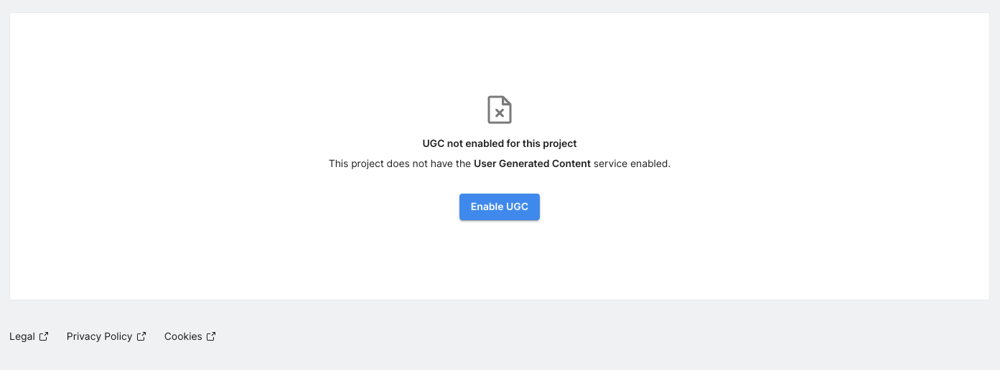

# Unity User-Generated Content Quick Start Guide

Welcome to Unity User Generated Content (UGC)!

UGC is a format and content-agnostic service that helps you incorporate user-generated content features into your game, no matter your implementation. You can write your content creation edition tools while UGC handles content storage, discovery, ingestion, moderation, and ratings. If your game is using the Unity Engine, you can integrate the Unity UGC Package into your game. If you use another game engine, you can use the [Unity UGC Client REST API](https://services.docs.unity.com/user-generated-content-client/v1)

Use this quick start guide to:

-   Onboard your Unity project with UGC.
-   Set up the UGC Unity Package.
-   Integrate UGC into your project.

Before we start, it's helpful to understand the two types of UGC users: 

-   The player
-   The content creator

A *player* can browse, rate, report, and play published content.
A *content creator* (creator) is a type of player that can do everything a player can plus create, update, and delete their content.

The simplest way to handle content is to use the same format for what the creator "writes" and the game "reads" when a player wants to play that content.

However, there are use cases where you will want a distinct format for "edit-time" content versus "play-time" content, for example, a platform-specific version of the content for each platform your game supports.
By adding one or more *representations* to the content, you can create one or more such version, each with its specific format and tags.

Thank you for testing this version of our product. We encourage you to provide feedback to help us improve it.

## Enable UGC in Unity Dashboard
1.  Log in to the [Unity Dashboard](https://dashboard.unity3d.com/).
2.  Navigate to your project, then select [*LiveOps > User Generated Content > About and Support.*](https://dashboard.unity3d.com/gaming/user-generated-content)
3.  Click "Get Started" and follow the steps.

> :memo:&nbsp;&nbsp;&nbsp;**Important** 
> You must enable UGC through the settings to make your project visible to users. Go to *User Generated Content > Overview*, then enable *User Generated Content*.

> Make sure you go to "Web Portal Setup" and set "Site visibility" to "Visible" so you can moderate content.

## Install Unity UGC Package
The UGC Package is available in Package Manager. If not, you can download it via the *Setup Guide > Download SDK* and see [Installing a package from a local tarball file](https://docs.unity3d.com/Manual/upm-ui-tarball.html) to learn how to add a tarball package to your Unity Project.

> :memo:&nbsp;&nbsp;&nbsp;**Note** 
> Like other Unity Gaming Services, you must link your project to your Unity Account through the Unity Dashboard before using the UGC Package.

## Integrate with the UGC SDK
The following code samples show how to perform various tasks with the UGC SDK:

- [Unity User-Generated Content Quick Start Guide](#unity-user-generated-content-quick-start-guide)
  - [Enable UGC in Unity Dashboard](#enable-ugc-in-unity-dashboard)
  - [Install Unity UGC Package](#install-unity-ugc-package)
  - [Integrate with the UGC SDK](#integrate-with-the-ugc-sdk)
    - [Authenticate a player](#authenticate-a-player)
    - [Create and modify content](#create-and-modify-content)
      - [Create content](#create-content)
      - [Update content](#update-content)
      - [Delete content](#delete-content)
      - [Update content metadata](#update-content-metadata)
    - [Retrieve content](#retrieve-content)
      - [Retrieve a list of content](#retrieve-a-list-of-content)
      - [Retrieve a list of the player's content](#retrieve-a-list-of-the-players-content)
      - [Page through results](#page-through-results)
      - [Search content](#search-content)
      - [Search content with content report type.](#search-content-with-content-report-type)
      - [Get specific content](#get-specific-content)
      - [Display the thumbnail as a sprite](#display-the-thumbnail-as-a-sprite)
    - [Manage player content subscriptions](#manage-player-content-subscriptions)
      - [Get all tags](#get-all-tags)
      - [Subscribe to content](#subscribe-to-content)
      - [Get subscribed contents list](#get-subscribed-contents-list)
      - [Unsubscribe from content](#unsubscribe-from-content)
      - [Rate content](#rate-content)
    - [Create and modify representation](#create-and-modify-representation)
      - [Create representation](#create-representation)
      - [Create representation version](#create-representation-version)
      - [Update representation](#update-representation)
      - [Delete representation](#delete-representation)
    - [Retrieve representation](#retrieve-representation)
      - [Retrieve a list of representation](#retrieve-a-list-of-representation)
      - [Retrieve a list of representation version](#retrieve-a-list-of-representation-version)
      - [Search representation within project](#search-representation-within-project)
      - [Get specific representation](#get-specific-representation)
    - [Moderation](#moderation)
      - [Report inappropriate content](#report-inappropriate-content)
      - [Approve content](#approve-content)
      - [Reject content](#reject-content)
      - [Search content waiting for moderation](#search-content-waiting-for-moderation)
  - [Glossary](#glossary)

### Authenticate a player
In most cases, you will want a content creator to log in before they can submit content to your project. Authenticating content creators has multiple benefits:

-   It allows creators to edit their content to fix or improve it.
-   It prevents creators from editing content that isn't theirs.
-   It helps you reward or sanction creators for their content.

You can authenticate players, including creators, using any supported Unity Authentication [identity providers](https://docs.unity.com/authentication/SettingupExternalIdentityProviders.html). If it is your first time using the UGC package and you don't want to start implementing the identity providers, you can authenticate your users anonymously.

[!code-cs]

Here's an authentication example using Apple ID as the identity provider.

[!code-cs]

> :memo:&nbsp;&nbsp;&nbsp;**Tip** 
> See the Unity Authentication documentation to learn more.

### Create and modify content

#### Create content
After the creator logs in and is ready to publish their content, the game can upload it. 

[!code-cs]

Content creators can have a thumbnail image of content before they create content. However, if they don't have a thumbnail ready, they have a couple of options:

-   Use a placeholder image and update it later.
-   Generate a screenshot of the content asset to use as the thumbnail.
-   Leave it empty.

Use `ScreenCapture.CaptureScreenshot` ([ScreenCapture](https://docs.unity3d.com/ScriptReference/ScreenCapture.html)) to generate a screenshot of the content asset to use as the thumbnail.

> :memo:&nbsp;&nbsp;&nbsp;**Tip** 
> Move the camera in the scene view to align the game view with the asset before calling ScreenCapture.CaptureScreenshot.

#### Update content
Creators can update published content they created by creating a new version for that content. 

> :memo:&nbsp;&nbsp;&nbsp;**Note** 
> You must authenticate content creators before allowing them to update or delete their content. See [Authenticate a player](#authenticate-a-player).

[!code-cs]

#### Delete content
Creators can delete content they created.

> :memo:&nbsp;&nbsp;&nbsp;**Note** 
> You must authenticate content creators before allowing them to update or delete their content. See [Authenticate a player](#authenticate-a-player).

[!code-cs]

#### Update content metadata
Creators can update their content's metadata without uploading new code (binaries).

> :memo:&nbsp;&nbsp;&nbsp;**Note** 
> You must authenticate content creators before allowing them to update or delete their content. See [Authenticate a player](#authenticate-a-player).

[!code-cs]

### Retrieve content
> :memo:&nbsp;&nbsp;&nbsp;**Note**
> Most methods in the UGC SDK use a `Content` class to transport the metadata of a content entity. 

Players, including content creators, can search for content by calling `GetContentsAsync`. It allows players to filter content by text and tags and sort results by various properties.

> :memo:&nbsp;&nbsp;&nbsp;**Note**
> Players only see published content, and content creators see published and unpublished content they created. [Unity Cloud Project Owners](https://docs.unity.com/ugs-overview/MembersGroupsRoles.html#ProjectLevelRoles) can view, update, and delete any content.

#### Retrieve a list of content
Use `GetContentsAsync` to get a list of content without filters.

[!code-cs]

#### Retrieve a list of the player's content
Use `GetPlayerContentsAsync` to get a list of the player's content without filters.

[!code-cs]

#### Page through results
You can page through paginated content, such as `Content` and `Subscription`. Most methods that return a list of items are paginated. You can set the page and the page size using the `Offset` and `Limit` properties of the `Get[ItemType]Args`. 

[!code-cs]

#### Search content
You can filter and sort lists of content by calling `GetContentsAsync` and setting the appropriate `GetContentsArgs` properties. 

[!code-cs]

#### Search content with content report type.
You can get a specialized content list by calling `GetContentsAsync` with a `ReportType` set to any property value of `ContentReportType`. 

> :memo:&nbsp;&nbsp;&nbsp;**Tip** 
> You can mix and match `ReportType` and any other `GetContentsArgs` properties. 

[!code-cs]

#### Get specific content
You can get content with or without its binary data (details).

[!code-cs]

You can retrieve content by its ID (`Content.Id`). If you don't know the ID of the content, you can try to retrieve the ID by getting all the contents and comparing it to other parameters, like the name.

[!code-cs]

#### Display the thumbnail as a sprite
If you are listing the retrieved content, you might want to show the thumbnail to your players. To convert the bytes array of the content thumbnail you receive to a sprite, you can use `Texture2D.LoadImage()` and then create a sprite asset from it. 

[!code-cs]

### Manage player content subscriptions
#### Get all tags
Use GetTagsAsync to get your project's tags.

> :memo:&nbsp;&nbsp;&nbsp;**Note** 
> Tags are simple strings generated alongside a GUID to ensure uniqueness. You can associate content with specific tags to allow for quick searching.

[!code-cs]
     
#### Subscribe to content
Players can subscribe to content. It's up to you to decide what you do with this information. For example, you could notify them whenever a creator the player is subscribed to publishes a newer version.

[!code-cs]

#### Get subscribed contents list
Players can retrieve a list of content they have subscribed to.

[!code-cs]

#### Unsubscribe from content
Players can unsubscribe from content.

[!code-cs]

#### Rate content
Players can rate published content—valid values for ratings range from 1.0f to 5.0f. 

[!code-cs]

### Create and modify representation
#### Create representation
Creators can create representations for the content they created.

[!code-cs]

#### Create representation version
Creators can create new representation version for the content they created.

[!code-cs]

#### Update representation
Creators can update published representation they created.

> :memo:&nbsp;&nbsp;&nbsp;**Note** 
> You must authenticate content creators before allowing them to update or delete their content. See [Authenticate a player](#authenticate-a-player).

[!code-cs]

#### Delete representation
Creators can delete representation they created.

> :memo:&nbsp;&nbsp;&nbsp;**Note** 
> You must authenticate content creators before allowing them to update or delete their content. See [Authenticate a player](#authenticate-a-player).

[!code-cs]

### Retrieve representation
> :memo:&nbsp;&nbsp;&nbsp;**Note**
> Most methods in the UGC SDK use a `Representation` and `RepresentationVersion` class to transport the metadata of a representation/representationVersion entity. 

#### Retrieve a list of representation

Use `GetRepresentationsAsync` to get all representations of a content.

[!code-cs]

#### Retrieve a list of representation version

Use `GetRepresentationVersionsAsync` to get a list of representation versions.

[!code-cs]

#### Search representation within project
With `SearchRepresentationsAsync` you can search representations from any content within the current project.

[!code-cs]

#### Get specific representation
You can get representation with or without its binary data (details).

[!code-cs]

### Moderation

#### Report inappropriate content
Players can report inappropriate content. You, as the developer, or the community, can set guidelines for what determines the appropriateness of content.
Each time a unique player reports content as inappropriate, it increments a report counter specific to that content. As the developer, you must set a threshold for content reports. After an instance of content goes over your project's report threshold, you can hide it until you review it. During the review, you can decide whether to republish it or not.

[!code-cs]

#### Approve content
A player with moderation rights is able to approve a content marked for moderation. The content would then be available publicly.

[!code-cs]

#### Reject content
A player with moderation rights is able to reject a content marked for moderation. The content would then be hidden.

[!code-cs]

#### Search content waiting for moderation
A player with moderation rights is able to search all contents marked for moderation.

[!code-cs]

## Glossary
The following list contains a list of glossary terms associated with the UGC service.

**Player** - A player is a user authenticated by the Unity Authentication Service.

**Content creator** - A content creator, also called a creator, is a player who creates content for the project. They can do everything a player can and have ownership of their content.

**Tag** - A tag is a developer-managed text label that creators can associate with their content, and its primary purpose is to help players find relevant content.

**Content** - Content refers to the user-generated content that creators contribute, composed of metadata and a binary.

**Content entry** - Content entry refers to a specific published content entry.

**Binary** - A binary, or content binary, is part of a user-generated content entry that represents the payload containing the playable part of the content.

**Content metadata** - Content metadata is part of a user-generated content entry that refers to all attributes describing the content, such as the title, description, last update date, and ratings.

**Content thumbnail** - A content thumbnail is a small picture representing a user-generated content entry the creator provides when they publish content. Ideally, the thumbnail should illustrate the content; however, it’s also possible for content creators to  use a placeholder image as the thumbnail. The thumbnail makes it easy for players to identify a specific user-generated content entry when searching in-game.

**Content rating** - A content rating refers to the average rating of a user-generated content entry. Players can rate content and use content ratings to sort and filter content.

**Content rate threshold** - A content rate threshold is a moderation setting in the Unity Dashboard indicating how many players must report a content entry as inappropriate before it is unpublished and moderated. 

**Published content** - Published content refers to content that players can search for, rate, report, and play.

**Unpublished content** - Unpublished content refers to content available only to its creator. Content creators can publish and unpublished content they created.

**Subscribe** - Subscribe refers to a player's action to subscribe to updates from a particular content entry. Players can also subscribe to content to demonstrate their interest in the content. Subscribing to content adds the content to the player’s subscription list.

**Unsubscribe** - Unsubscribe refers to a player's action to unsubscribe from a particular content entry’s updates. Players can also unsubscribe to indicate they’re no longer interested in the content. Unsubscribing from content removes the content from the player’s subscription list.

**Subscription list** - A subscription list contains all the content a player has subscribed to. You, as the developer, can use subscription lists to perform quality-of-life operations for the player, such as preloading content and notifying the player when new versions of content become available. 

**Content list** - The content list contains all published content available to other players.
